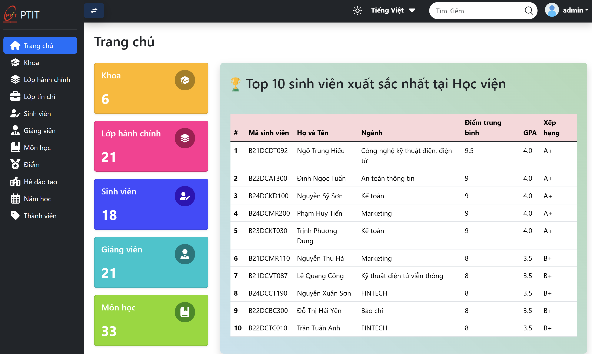
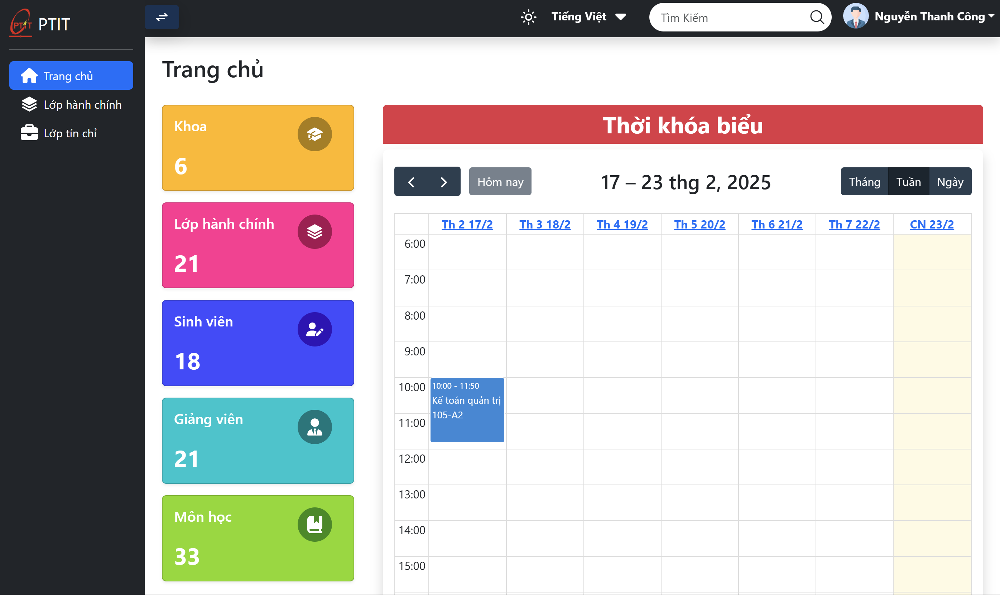
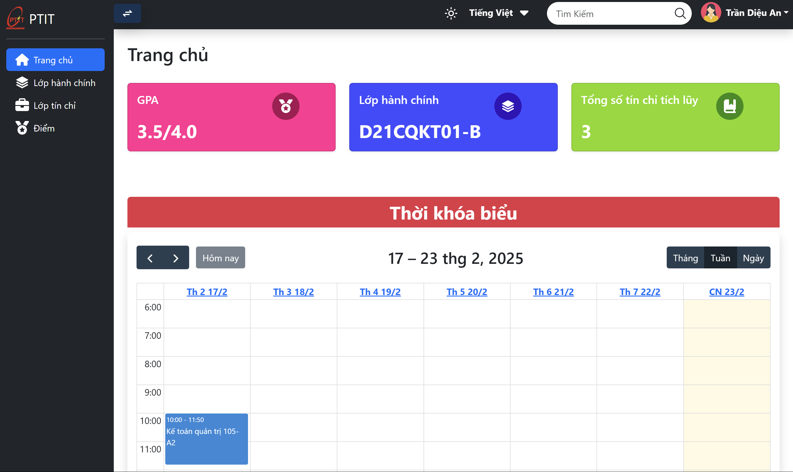

# StudentManager

Welcome to the StudentManager project documentation. This guide will help you set up, configure, and use the StudentManager application.

## Table of Contents
- [Introduction](#introduction)
- [Objectives](#objectives)
- [Features](#features)
- [Technology Stack](#techstack)
- [Usage](#usage)

## 📖 Introduction
The Student Management System (SMS) is a web-based application designed to streamline the management of student information, academic records, courses, and attendance. It replaces manual, paper-based processes with a centralized digital platform, enabling educational institutions to efficiently track and manage student data while improving communication between administrators, teachers, and students.

## 🎯 Objectives
- **Digitize workflows**: Replace paper-based records with a secure, centralized database.

- **Simplify academic management**: Streamline course assignment, and grade tracking.

- **Enhance accessibility**: Provide role-based access for administrators, teachers, and students.

- **User friendly**: Intuitive interface, easy to use.

## 🌟 Features
- Student Profile Management
    - Create, update, and archive student profiles.

    - Store personal details (ID, name, contact, class, major) and academic history.

    - Export student lists in Excel/PDF formats.

- Course & Class Management
    - Create courses and assign instructors.

    - Schedule classes with a visual calendar interface.

- Grade Management
    - Enter grades per subject.

    - Automatically calculate GPA, final grades, and academic performance rankings.

- Reporting & Analytics
    - Export academic transcripts.

    - Export data to various formats (CSV, PDF, etc.).

- User Authentication & Roles
    - Secure login with Laravel Breeze/Sanctum.

    - Role-based access:
        - Admin: Full system control.

        - Instructor: Manage courses, grades, and view student data.

        - Student: View grades, schedules, and personal information.

- UI/UX Enhancements
    - Responsive Design:
        - Optimized for mobile, tablet, and desktop screens.

        - Mobile-first approach with Bootstrap 5 Flexbox/Grid layouts.

    - Light/Dark Theme Toggle:
        - Users can switch between themes dynamically.

        - Theme preference saved in localStorage for consistency.

    - Multi-language Support:
        - Supports English and Vietnamese (easily extendable to other languages).

        - Language switcher dropdown in the navigation bar.

        - Translations managed via Laravel’s localization files.

## ⚙️ Technology Stack
- Backend:
    - Framework: Laravel 11.x (PHP)

    - Database: MySQL

    - Authentication: Laravel Sanctum (API) / Breeze (UI)

    - Localization: Laravel’s built-in multi-language support.

- Frontend:
    - Templating: Blade

    - Styling: Bootstrap 5, CSS Variables (for theme switching)

    - Dynamic UI: JavaScript, Jquery libraries (chart.js, datatable.js, calendar.js, etc.)

    - Language Management: JSON-based translation files.

- Tools:
    - Composer, Artisan CLI

    - Git, Postman (API testing)

## 🚀 Usage
To use the StudentManager application:
1. Start the development server: `php artisan serve`
2. Open your browser and navigate to `http://localhost:3000 (customize configuration in /config)`
3. Log in with existing credentials.
    - Admin: emailtestcode321@gmail.com - admin123
    - Instructor: dtnanh@gmail.com - teacher123
    - Student: antd.b21kt004@stu.ptit.edu.vn - student123
4. Use the dashboard to manage students, classes, and generate reports.

<h1 style="text-align:center;">Admin Dashboard</h1>

<h1 style="text-align:center;">Instructor Dashboard</h1>

<h1 style="text-align:center;">Student Interface</h1>

